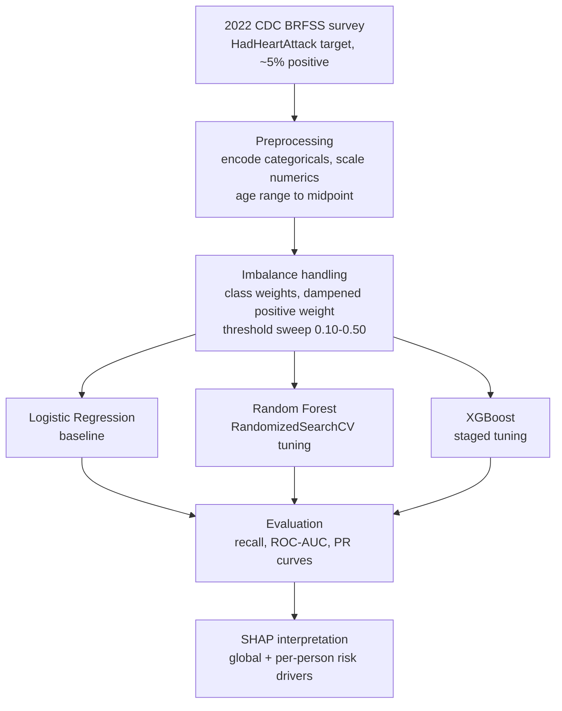

# Heart Disease Prediction

**Imbalanced classification on the 2022 CDC BRFSS health survey, from preprocessing through SHAP interpretation.**

This project builds a model to flag people who have had a heart attack, using the 2022 CDC Behavioral Risk Factor Surveillance System survey. The hard part here is the imbalance. Only about 5% of respondents are positive cases, which makes plain accuracy worthless and turns the whole task into catching a rare event without drowning in false alarms. The pipeline runs from cleaning and encoding through three models, careful imbalance handling, and SHAP to explain what the strongest model leaned on.

<p>
  
  
  
  
  
  
</p>

---

> ### Too Long; Didn't Read 
> - **The problem.** Cardiovascular disease is the leading cause of death worldwide, behind close to a third of all deaths. This project builds a model to flag people who have had a heart attack, using the 2022 CDC BRFSS health survey.
> - **The real challenge.** Only about 5% of respondents are positive cases. That imbalance makes plain accuracy meaningless and turns the task into catching a rare event without burying it in false alarms.
> - **The build.** Three models in increasing order of muscle, logistic regression, random forest, and a staged-tuned XGBoost, all judged on recall, precision, ROC-AUC, and F1 rather than accuracy.
> - **The result.** The tuned XGBoost caught about two-thirds of true cases at a ROC-AUC near 0.89, and SHAP traced its calls to angina history, age, mobility, smoking, and prior stroke or diabetes.

---

## Table of Contents
1. [The Problem](#1-the-problem)
2. [What Makes This Project Difficult](#2-what-makes-this-problem-difficult)
3. [System Overview](#3-system-overview)
4. [The Data](#4-the-data)
5. [Preprocessing and Feature Engineering](#5-preprocessing-and-feature-engineering)
6. [Handling Class Imbalance](#6-handling-class-imbalance)
7. [Models and Results](#7-models-and-results)
8. [Model Interpretability (SHAP)](#8-model-interpretability-shap)
9. [Insights and Recommendations](#9-insights-and-recommendations)
10. [Limitations](#10-limitations)
11. [Future Directions](#11-future-directions)
12. [Tech Stack](#12-tech-stack)
13. [Repository Structure](#13-repository-structure)
14. [Reproducing the Pipeline](#14-reproducing-the-pipeline)
15. [About the Author](#15-about-the-author)

---

## 1. The Problem

Cardiovascular disease is the leading cause of death worldwide, responsible for close to a third of all deaths. A model that could pick out the people most likely to have heart trouble, from nothing more than survey answers about their health and habits, would be a useful screening aid for a public-health team working at population scale.

The 2022 BRFSS survey makes that question answerable. It collects self-reported health, behavior, and demographic data from a national sample of adults, including whether each respondent has ever had a heart attack. That field is the target here. The job is to predict it from everything else the survey captures.

The difficulty is baked into the data. Heart attacks are rare in the general population, so the positive class is tiny, and a model that simply guesses "healthy" every time would look accurate while being useless. Getting past that illusion is most of the work.

---

## 2. What Makes This Project Difficult

A rare-event classification problem punishes the obvious approach. With positives sitting near 5% of the data, a model can post a 95% accuracy score by never flagging anyone at all, so accuracy has to be thrown out as a measure of success from the start.

A few of the challenges that shaped the build:

| Challenge | Why it bites | The response in this project |
|---|---|---|
| **Severe class imbalance (about 5% positive)** | A model hits 95% accuracy by calling everyone healthy | Class weighting, a dampened positive-class weight, and recall-focused metrics |
| **Cost asymmetry** | Missing a real case matters more than a false alarm in screening | Threshold sweeps from 0.10 to 0.50 to choose a sensible operating point |
| **Mixed feature types** | Survey data blends categorical, binary, and numeric fields | Encoding tailored to each type, with scaling only where the model needs it |
| **Interpretability demands** | A health model has to justify its calls | SHAP global and per-person explanations on the final model |

The aim was a model that earns its keep on the metric that matters for screening, which is how many real cases it catches, while keeping false alarms in check.

---

## 3. System Overview



---

## 4. The Data

The source is the 2022 CDC Behavioral Risk Factor Surveillance System, a national telephone survey of U.S. adults, in the cleaned form distributed on Kaggle as an indicators-of-heart-disease dataset. Each row is one respondent. The target is whether that person reported ever having a heart attack.

The features span three kinds of fields. There are categorical descriptors like general health, smoker status, race and ethnicity, and state. There is a long set of yes-or-no health flags covering conditions and behaviors, from stroke and diabetes to physical activity and difficulty walking. And there are continuous measures like BMI, height, weight, sleep hours, and self-reported days of poor physical or mental health.

---

## 5. Preprocessing and Feature Engineering

Survey data needs shaping before a model can use it, and each field type got handled on its own terms.

The yes-or-no flags were mapped to 1 and 0. Categorical fields were one-hot encoded, with a small but deliberate difference between models: the logistic regression dropped the first dummy of each category to avoid the collinearity that would otherwise destabilize its coefficients, while the tree models kept every level, since they do not care about that kind of redundancy.

Age arrived as a text range rather than a number, in bands like "Age 25 to 29." I converted each band to a single value near its midpoint, so age could enter the models as a clean continuous feature instead of a pile of category dummies. For the logistic regression, the continuous features, age included, were standardized so that a feature measured in kilograms would not swamp one measured in hours of sleep. The tree models skipped scaling, which they do not need.

---

## 6. Handling Class Imbalance

With the positive class near 5%, imbalance handling was the center of the project rather than an afterthought.

For the random forest, I used balanced class weights, which tell the model to weight the rare positive cases in inverse proportion to how often they appear. For XGBoost, I built the same idea by hand through the positive-class weight, then cut it in half. The full correction pushed the model too far toward predicting positives, flooding the results with false alarms, and the dampened version struck a far better balance.

```python
# damped positive-class weight for XGBoost
scaled_weight = (y_train == 0).sum() / (y_train == 1).sum()
scaled_weight = scaled_weight * 0.5
```

On top of the weighting, every model was scored across decision thresholds from 0.10 to 0.50, since the default 0.50 cutoff is the wrong tool on a lopsided problem. Sweeping the threshold makes the precision-recall tradeoff explicit and lets the operating point get chosen on purpose. The headline metrics throughout are recall, precision, ROC-AUC, and F1, the measures that reward finding the minority class.

---

## 7. Models and Results

I built up from a simple baseline to a tuned gradient-boosted model, so each step could show what the added complexity bought.

**Logistic regression** came first, fit with statsmodels on scaled, dummy-encoded features. It works as a readable baseline and a reality check. At a standard threshold it caught only 24% of true cases, which set a low bar and confirmed that a linear model was not going to carry this on its own.

**Random forest** came next. I started with a balanced base model, then tuned it with randomized search over tree count, depth, leaf and split sizes, feature sampling, and row sampling, scoring on F1 across stratified folds. The tuned forest pushed recall to 60% at a ROC-AUC of 0.888.

**XGBoost** was the final and strongest model. I tuned it in stages rather than all at once, which keeps the search space manageable and the results readable. The first pass set the tree count and learning rate. From there I tuned gamma, tree depth, and the minimum child weight together, then handled row and column subsampling in a final pass. The tuned model reached 66.7% recall at a ROC-AUC of 0.887.

| Model | Recall (positive class) | ROC-AUC |
|---|---|---|
| Logistic Regression (baseline) | 24% | not recorded |
| Random Forest (tuned) | 60% | 0.888 |
| **XGBoost (tuned)** | **66.7%** | **0.887** |

The two tree models land in a near-tie on ROC-AUC, with XGBoost pulling clear on recall, which is the metric that matters most when the goal is catching real cases. I compared them directly on ROC and precision-recall curves.


*ROC curves for the tuned random forest and XGBoost models.*


*Precision-recall curves for both tuned models, where the imbalance shows.*

---

## 8. Model Interpretability (SHAP)

A health-risk model that cannot explain itself is hard to trust and harder to act on. I ran SHAP on the tuned XGBoost model over a sample of the test set to see what it leaned on, both across the population and for individual predictions.


*Global feature importance from SHAP on the tuned XGBoost model.*

The strongest signals were a history of angina, older age, difficulty walking, current or former smoking, and a history of stroke or diabetes. The beeswarm view adds direction, showing how each feature pushed risk up or down across respondents.


*SHAP beeswarm showing each feature's effect across the sampled respondents.*

SHAP also breaks down a single prediction, which turns an abstract risk score into a specific, explainable call for one person.


*SHAP waterfall decomposing the risk prediction for one respondent.*

---

## 9. Insights and Recommendations

The model's strongest signals line up with what cardiology already knows, which is a good sign that it learned something real rather than noise. A history of angina, advancing age, difficulty walking, a smoking history, and prior stroke or diabetes all rose to the top.

Translated into something a public-health team could act on, a few recommendations follow:

- **Manage cholesterol and blood pressure aggressively** to head off the angina that surfaces as the single strongest signal.
- **Screen diabetic patients and adults over 65 more often**, since both groups carry elevated risk in the model.
- **Push smoking cessation**, and keep watching former smokers, whose risk stays elevated well after they quit.

---

## 10. Limitations

Several things bound what these results should be taken to mean.

- **The data is self-reported.** BRFSS is a telephone survey, so the heart-attack labels and the behavior and condition fields all carry recall and reporting error. The model is only as clean as people's answers.
- **Some top predictors are markers, not risk factors.** Angina, having had a chest scan, and being flagged high-risk in the past year often describe people already known to have heart trouble. That means the model is partly identifying patients already in the system rather than forecasting undiagnosed risk, which inflates apparent performance and limits its use as a true preventive screen.
- **SHAP shows association, not cause.** A feature mattering to the model does not make it a lever. Angina predicts heart attacks because the two share underlying disease, so treating the symptom is not the same as removing the risk.
- **Recall tops out in the mid-60s.** Even the best model misses about a third of real cases at its operating threshold, which is a meaningful gap for anything meant to screen a population.
- **It is a single-year snapshot.** The survey is cross-sectional, so the model links current features to a past event rather than predicting a future one.
- **No external validation.** Everything was scored on a held-out split of the same survey year, with no test on a different population or a later year.

---

## 11. Future Directions

- **Rebuild on pre-diagnosis features only.** Stripping out symptoms and care markers, then modeling on the risk factors that come before a diagnosis, would turn this into a genuine preventive screen.
- **Validate externally.** Testing on other BRFSS years or a clinical cohort would show whether the performance holds outside this one snapshot.
- **Calibrate the probabilities.** Calibrating the output would let the score read as a real risk percentage a clinician could use directly.
- **Tie the threshold to real costs.** Setting the operating point from the actual costs of a missed case versus a false alarm would replace a hand-picked threshold with a grounded one.
- **Compare resampling against weighting.** Bringing in SMOTE or a similar method and testing it head-to-head with class weighting would confirm the imbalance approach is the best available.
- **Check subgroup fairness.** Measuring performance across age, sex, race, and state would surface whether the model serves some groups better than others.

---

## 12. Tech Stack

| Category | Tools |
|---|---|
| **Language** | Python 3.10+ |
| **Data** | 2022 CDC BRFSS survey (Kaggle indicators-of-heart-disease dataset) |
| **Wrangling** | `pandas`, `numpy` |
| **Modeling** | `scikit-learn` (Random Forest, search), `xgboost`, `statsmodels` (logistic regression) |
| **Imbalance** | class weighting, dampened positive-class weight, `imbalanced-learn` (SMOTE available) |
| **Interpretability** | `shap` |
| **Visualization** | `plotnine`, `matplotlib`, `seaborn` |

---

## 13. Repository Structure

```
heart-disease-prediction/
├── README.md
├── requirements.txt
├── src/
│   └── heart_disease_model.py    # preprocessing, logistic / RF / XGBoost, tuning, SHAP
├── data/
│   └── heart_2022_no_nans.csv
├── reports/
│   └── figures/
│       ├── roc_curve_comparison.png
│       ├── pr_curve_comparison.png
│       ├── shap_global_importance.png
│       ├── shap_beeswarm.png
│       └── shap_waterfall_example.png
└── .gitignore
```

---

## 14. Reproducing the Pipeline

```bash
# 1. Environment
python -m venv .venv && source .venv/bin/activate
pip install -r requirements.txt

# 2. Run the pipeline
python src/heart_disease_model.py
```

Two things to know before running. The dataset path is hardcoded near the top of the script, so point it at wherever your copy of `heart_2022_no_nans.csv` lives. And the hyperparameter searches take a while, so the full run is longer than a single model fit would suggest.

**`requirements.txt`**
```
pandas
numpy
scikit-learn
xgboost
shap
statsmodels
imbalanced-learn
plotnine
matplotlib
seaborn
```

---

## 15. About the Author

Built by **Tommy Gillan**. I hold an M.S. in Business Analytics with a Sports Analytics concentration from the University of Notre Dame, where most of my work has centered on sports data.

This project steps outside that lane on purpose. The skills that decide whether a classifier is any good do not change when the subject does. Wrestling a brutal class imbalance into something useful is the same job whether the rows are patients or pitchers. So is tuning a model until its complexity earns its place, and so is explaining what it learned to someone who has to trust the output. Heart disease is a domain where getting those things right carries real weight, which made it worth the work.

*Connect:* [LinkedIn](https://www.linkedin.com/in/tommy-gillan/) · [Email](mailto:thomasgillan63@gmail.com) · [Portfolio](https://github.com/tgillz63)

---

<sub>Data from the public 2022 CDC BRFSS survey. This is an independent research project and is not medical advice or a diagnostic tool.</sub>
